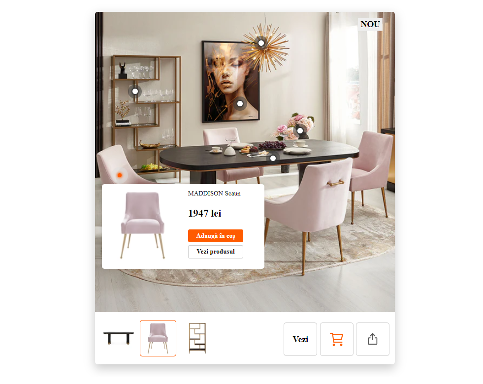

# Hotspot Image Component
  

## Overview

The Hotspot Image Component is a React-based UI component that displays an image with interactive hotspots. Each hotspot shows additional product information when hovered, including an image, description, price, and action buttons for adding the product to the cart or viewing product details.

## Features

- Displays an image with interactive hotspots.
- Shows product information (image, name, description, price) in a tooltip on hover.
- Provides action buttons for adding the product to the cart and viewing product details.
- Supports dynamic rendering based on JSON data.

## Installation

To use this component in your project, follow these steps:

1. **Clone the Repository:**

   ```bash
   git clone https://github.com/AdrianBirta/hotspot-image.git

2. **Navigate to the Project Directory:**

    ```bash
    cd hotspot-image

3. **Install Dependencies:**

    ```bash
    npm install


## Development
  To start developing or make changes to the component:

1. **Start the Development Server:**
    
    ```bash
    npm run dev

2. **Build the Project:**

    ```bash
    npm run build


## Usage

1. **Add the Component to Your React Application:**

  Import the `HotspotComponent` into your React application:

    import HotspotComponent from './path/to/HotspotComponent';

2. **Include JSON Data in Your HTML:**

  Add a `<script>` tag with the `id="hotspotsData"` containing your JSON data. This script should be included in your HTML file where you want to render the hotspots.

  ```bash
  <script id="hotspotsData" type="application/json">
    [
      {
        "id": "componentID",
        "src": "https://...url-to-image",
        "hotspots": [
          {
            "top": "10%",
            "left": "20%",
            "product": {
              "img": "https://...product-image",
              "name": "Product Name",
              "price": "$100",
              "description": "Short product description",
              "addToCartLink": "https://...add-to-cart-url",
              "detailsLink": "https://...product-details-url"
            }
          }
        ]
      }
    ]
  </script>
  ```

3. **Initialize Hotspots in Your JavaScript:**

  Ensure you have a method to initialize the hotspots. For example:

      // In your main application or component file
      useEffect(() => {
        window.initHotspots(); // Calls the function to initialize hotspots
      }, []);
